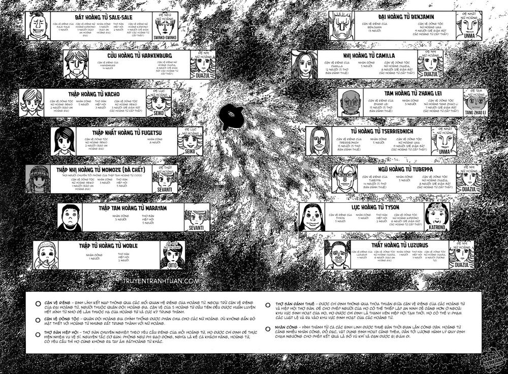

# ARC LỤC ĐỊA TỐI

---

## LỤC ĐỊA TỐI

---

### ➊ Lục đia tối và Cuộc chiến vương quyền

Hai phần Lục đia tối và Cuộc chiến vương quyền này bắt đầu từ chương 340 đến hiện tại là 390.

### ➋ Lục địa tối là gì?

---> Thế giới mà chúng ta biết, nơi mọi thứ đang diễn ra từ trước đến nay chỉ là các đảo và lục địa nằm giữa 1 cái hồ lớn có tên là hồ Mobius. Phần bên ngoài cái hồ này chính là lục địa tối (DC- Dark Continent).
---> Chính vì nó còn nhiều bí ẩn nên con người luôn muốn thám hiểm nó, nhưng quan trọng hơn chính là 5 tài nguyên quý hiếm có thể có được từ DC (được bảo vệ bởi 5 đại họa) : Ma thạch Mujinseki (bảo vệ bởi thú ăn thịt Papu), Thảo dược chữa bách bệnh ( bảo vệ bởi vũ khí thực vật Brion), lúa Nitro ( được bảo vệ bởi nhị vỹ xà HellBell), tam chân thủy Sangensui ( được bảo vệ bởi Sinh thể khí Ai), loài thực vật hóa học Metalion (được bảo vệ bởi Zobae -Căn bệnh bất tử). Còn công dụng của chúng như thế nào thì các bạn có thể xem lại chapter 344 nha.
---> Đã có 149 lượt thám hiểm nhưng chỉ có 28 người sống sót trở về từ 5 chuyến thám hiểm được thực hiện sau khi V5 kí hiệp ước bất khả xâm phạm.

### ➌ V5 là gì?

---> Là 1 khối 5 quốc gia thành lập kí hiệp ước trên để ngăn chặn các chuyến thám hiểm vì lo ngại các đại họa sẽ đe dọa ra thế giới. Sau này khối này gia nhập thêm quốc gia Kakin và trở thành V6.

### ➍ Ý nghĩa việc sáp nhập Kakin vào V5 ->V6?

---> Do Kakin không thuộc V5 nên họ không lệ thuộc hiệp ước trên và muốn tự mình tổ chức 1 chuyến thám hiểm lớn vào DC và ai cũng có thể tham gia kể cả dân thường, V5 lại là người tạo ra hiệp ước cấm vào DC nên họ buộc phải tìm cách ngăn cản Kakin hoặc ít ra là tranh giành được lợi ích nếu không ngăn được họ. Cuối cùng sau khi viện dẫn các số liệu cho thấy độ nguy hiểm của chuyến đi từ đó có cớ chính đáng để buộc Kakin gia nhập V6 và chịu các điều khoản hạn chế của hiệp ước, V6 sẽ đứng ra lãnh đạo chung và chuyến thám hiểm vẫn sẽ diễn ra, vua Kakin sẽ được vinh danh từ chuyến đi, đổi lại chiến lợi phẩm thu về từ chuyến đi sẽ chia đều.

### ➎ Beyond Netero là ai?

---> Beyond là con trai của cố hội trưởng hiệp hội Hunter Isaac Netero, người đã được V5 thuê để khám phá DC trước đây, nhưng vì lo ngại do Beyond muốn khai phá DC bằng một lộ tuyến mới (lí do là những lộ tuyến trước đây được khám phá đều là phần bờ phía Đông của hồ Mobius, do thế giới chỉ mới có quyển nhật kí thám hiểm quyển phía Đông từ Don Freecss, quyển nhật kí phía Tây vẫn chưa từng được biết tới) đều này có thể sẽ rước thêm 1 đại họa thứ 6 ngoài 5 đại họa đã được biết (cả 5 đại họa đều chưa có phương pháp đối phó) cùng với sự tác động của hội trưởng Isaac Netero lên V5 nhằm ngăn con trai mình nên V5 đã ra quy định ngăn cấm các chuyến đi vào DC.

---> Do việc thám hiểm DC bị ngăn cản, Beyond đã tìm đến Kakin để bắt đầu kế hoạch của mình đó là tạo ra 1 cuộc thám hiểm qui mô lớn. V5 lúc này buộc phải cho hiệp hội Hunter đi bắt Beyond để ngăn cản việc này hoặc ít ra là có con tin để dễ bề trao đổi lợi ích với Kakin.

### ➏ Kế hoạch của Beyond là gì?

---> Beyond cố tình đề ra cho Kakin chính sách tuyển ứng viên không hạn chế, điều này giúp cho V5 có cớ đế ép Kakin tham gia V6 (do chuyến đi sẽ làm ảnh hưởng đến mạng sống rất nhiều người điều này là vi phạm hiến chương) và V5 sẽ chuyển hướng sang bắt luôn chính Beyond. Bước tiếp theo, Beyond tự giao nộp mình cho Thập nhị chi (12C) nhằm tạo ra cho 12C tấm vé vào DC dễ dàng để làm nhiệm vụ khám phá DC mà hội trưởng Netero mong muốn, đổi lại điều kiện hắn nêu ra là muốn mọi kế hoạch phải tiến hành như Kakin đã định, danh tiếng sẽ thuộc về vua Kakin và nếu hắn thoát được khi tới DC thì hiệp hội không được làm gì hắn nữa.

---> Beyond làm vậy sẽ triệt được sức mạnh đáng gờm của hội Hunter và 12C, bởi họ bị phân tán nhiệm vụ vừa phải canh giữ hắn và đối phó với nhóm của hắn, vừa phải đảm bảo an toàn cho dân chúng trên tàu để giữ danh tiếng cho V5.

---> Hội Hunter không có lựa chọn khác là phải chấp nhận đề nghị này do từ chối sẽ mất đi cơ hội hoàn thành nhiệm vụ của V5 giao là bắt Beyond (bắt và ngăn Beyond không phải dễ dàng), còn nếu chỉ bắt hắn mà không chấp thuận kế hoạch thì 5000 kiến Chimera sẽ bị thả ra ngoài, trách nhiệm sẽ đè nặng lên hội Hunter. (Pariston đã liên kết cùng Beyond và Saiyu- khỉ chính là nội gián của liên minh này trong 12C).

---> Ngoài ra, hẳn là Beyond còn có kế hoạch gì đó để lợi dụng sức mạnh của 12C khi vào DC, chứ không đơn giản khi lôi kéo đối thủ đáng gờm của mình vào cuộc chơi. Đầu óc của Beyond và Pariston rất không tầm thường và Ging lúc này sẽ phải là đối trọng nặng kí để đấu trí và ngăn cản kế hoạch này. Nên Ging đã dùng mọi cách lấy vị trí số 2 trong nhóm chỉ dưới quyền Beyond, nhằm kiểm soát được Pariston.

---

- Ở 1 diễn biến khác:

**Hisoka vs Chrollo**

- Diễn ra khoảng thời gian trước cuộc thám hiểm khởi hành, Hisoka đã thỏa lòng mong mỏi bấy lâu khi được giao đấu với Chrollo. Trận đấu chủ tầng được diễn ra trên tháp thi đấu trên không. Chrollo sau khi có được niệm trở lại đã lợi hại hơn xưa với các kĩ năng mới + năng lực mượn từ Shalnark và Kortopi. Kết quả trận chiến Hisoka thất bại nhưng may mắn sống sót nhờ vào năng lực đặc biệt của mình.
- Băng Ryodan lúc này có ý định sẽ tham gia chuyến thám hiểm và quyết định hẹn gặp nhau ở trên tàu.
- Sau thất bại, Hisoka tuyên bố đồ sát các thành viên Ryodan cho đến hết. Shalnark và Kortopi là nạn nhân đầu tiên của Hisoka. Việc mất đi năng lực thì để chiến đấu với kẻ đang khát máu như Hisoka quả thật rất khó cho Shalnark và Kortopi.

---

## SƠ BỘ VỀ CUỘC CHIẾN VƯƠNG QUYỀN

---

### ➊ KẾ HOẠCH CỦA KURAPIKA?

---> Sau khi Ging và Pariston rời khỏi Thập nhị chi, để bổ sung lực lượng cho nhiệm vụ lớn lần này thì Cheadle (chó) - tân chủ tịch hiệp hội Hunter (chủ tịch thứ 14) đã liên lạc với Leorio và mời anh vào vị trí mà Ging để lại, kéo theo đó, Leorio muốn tiến cử Kurapika vào vị trí còn lại của Thập nhị chi.

---> Để thuyết phục tham gia, Kurapika đã được cho biết thông tin về người nắm giữ những mắt đỏ còn lại của bộ tộc Kurta - đó chính là Tứ hoàng tử Tserriednich của quốc gia Kakin.

---> Kurapika chấp nhận tham gia, hỗ trợ cho kì thi tuyển hunter gấp rút lần thứ 289th, đồng thời với năng lực ngón áp út anh đã giúp tìm ra được kẻ nội gián cho Pariston trong Thập nhị chi chính là Saiyu -khỉ. Mục đích chính của anh vẫn là tiếp cận tứ hoàng tử nên Kurapika đã chọn con đường là làm vệ sĩ hoàng gia và tình cờ anh làm vệ sĩ cho Thập tứ hoàng tử Woble.

### ➋ VƯƠNG TRIỀU NASUBI HUI GUO ROU CỦA KAKIN ?

---> Vị vua Hui Guo Rou của quốc gia Kakin, người chịu trách nhiệm cho chuyến thám hiểm DC, đang tìm kiếm người kế vị xứng đáng cho vương triều này. Người kế vị là người sẽ chiến thắng trong cuộc chiến vương quyền, thực chất nó là một cuộc chơi sinh tồn đẫm máu mà người còn sống sẽ chiến thắng (điều này vẫn chưa hẳn là đúng, vẫn còn nhiều bí ẩn trong cuộc chiến này). Nó diễn ra song song trong chuyến hành trình đến DC.

---> Tổng cộng vua Kakin có 8 người vợ sinh cho ông 14 vị hoàng tử (cả gái và trai đều được gọi là hoàng tử). 14 vị này sẽ là nhân vật chính cho cuộc chiến vương quyền. Theo truyền thống của vương triều này, trước khi bắt đầu cuộc chiến mỗi hoàng tử đều trải qua 1 nghi thức gọi là nghi thức bình kí sinh trứng. Sau nghi lễ, mỗi hoàng tử sẽ có 1 thú niệm hộ vệ, nhằm bảo vệ hoàng tử trong cuộc chiến. Đây là niệm kí sinh, một loại niệm mới trong truyện, các hoàng tử không thể nhìn thấy thú niệm kể cả hoàng tử có niệm lực hay không có niệm lực, nó tồn tại nhờ hấp thụ năng lượng sống của vật chủ. Tàu cá voi đen khởi hành là lúc cuộc chiến bắt đầu, các hoàng tử đã tuyển mộ các vệ sĩ để phục vụ cho cuộc chiến và kế hoạch của mình, đó là lí do Kurapika có thể tiếp cận các hoàng tử bằng con đường này cùng với một số đồng đội quen thuộc như: Biscuit, Hanzo, Izunavi, Melody, Basho..v.v..

---> Con tàu cá voi đen trong chuyến thám hiểm có sức chứa đến 200.000 người, cấu trúc gồm 5 tầng với an ninh ngăn giữa các tầng vô cùng nghiêm ngặt bởi quân đội hoàng gia:

- Tầng 1: nơi cao nhất, an ninh nghiêm ngặt nhất, nơi diễn ra cuộc chiến vương quyền. Các nhân vật ở đây gồm: hoàng gia Kakin, các hunter, các vệ sĩ của hoàng tử bao gồm 1 số hunter như Kurapika và đồng bọn, các quan chức cấp cao của V5, các trùm của 3 nhà Mafia (3 nhà này có quan hệ với một số hoàng tử, bản thân 3 ông trùm chính là những đứa con rơi không được thừa nhận của vua Kakin, trừ Brocco Li của nhà Cha-R là anh em cùng cha khác mẹ với vua Kakin).
  Tại đây 14 hoàng tử sẽ được bố trí ở 14 phòng khác nhau, các hoàng tử lớn hơn sẽ có lợi thế hơn trong việc giám sát các hoàng tử cấp thấp bằng vệ sĩ. Mỗi hoàng tử sẽ hạn chế có ~15 vệ sĩ nhưng 1 vài hoàng tử đã đẩy nó lên >15 nhờ việc bí mật gửi người tham gia kì thi hunter 289th và trở thành hunter.

  Ngoài ra nơi đây còn là nơi giam giữ Beyond Netero và được canh giữ bởi Kanzai (hổ), Saccho (ngựa) và Saiyu (khỉ - nội gián).

- Tầng 2: là tầng dành cho người nổi tiếng, giàu có, lính hoàng gia và quân đội, ngoài ra không có gì nổi bật.

- Tầng 3: mức độ an ninh càng giảm dần khi càng xuống thấp, nơi đây bắt đầu có các thành phần như: trộm cắp, mafia, v..v Nơi đây là địa bàn của mafia nhà Heil-Ly
  Ngoài ra tầng này còn có nhiều thập nhị chi ở đây như: Mizaistom-bò làm nhiệm vụ điều tra và quân đội, Botobai (rồng) lãnh đạo tòa án, Cheadle (chó), Gel (rắn) và Leorio bên phòng y tế. Cùng với đó còn có Pyon (thỏ), Ginta (cừu) và Cluck (gà).

- Tầng 4: các hành khách đại trà ở đây, các thể loại tội phạm nhiều hơn, các dịch vụ phúc lợi cũng ít lại. Tại đây là nơi hoạt động của Mafia nhà Xi-yu, quân đội, Mizaistom (bò) cũng có hoạt động ở tầng này.

- Tầng 5: Dân thường, tội phạm, thậm chí không có bác sĩ thường trú nào, chỉ 1 phòng y tế ở đây (giống kiểu tận cùng của xã hội, tận cùng của sự phân cấp giàu nghèo). Đây là nơi hoạt động của Mafia nhà Cha-R. Chrollo lần đầu được nhìn thấy trên tàu là ở đây.

---

**_SƠ BỘ MỘT SỐ SỰ VIỆC NỔI BẬT ĐÃ VÀ ĐANG DIỄN RA:_**

- Chuyến hành trình dự kiến sẽ mất 2 tháng để tới được tân lục địa (lục địa này là giả mạo lục địa tối, nơi đây sẽ là nơi dừng chân của hành khách phổ thông cũng như hoàng gia Kakin, phần còn lại sẽ tiếp tục thám hiểm lục địa tối thật sự sẽ đổi thuyền), tân lục địa này tiếp giáp với hải biên (hải biên là ranh giới, ra khỏi đây là đến vùng nước tối, qua khỏi vùng nước tối là đến bờ của lục địa tối) .

- Skill mới của Kurapika là xích ngón trỏ, với năng lực đánh cắp năng lực đối thủ (chi tiết năng lực các bạn có thể đọc lại truyện từ chapter 361 hoặc hôm nào mình sẽ có 1 bài về năng lực Kurapika). Điểm yếu của Hoàng đế thời gian được tiết lộ: 1s sử dụng là đánh đổi 1h tuổi thọ. Kurapika đã ngất xỉu 9 tiếng vì kiệt sức khi dùng hoàng đế thời gian liên tục.

- Các thú niệm của các hoàng tử đã xuất hiện trừ Thập tứ hoàng tử Woble. Một số hoàng tử như Benjamin (1st), Camilla (2nd), Tserriednich (4th), Halkenburg (9th) là người có thể sử dụng niệm. Chi tiết năng lực các bạn tham khảo bài viết sau:
  [Chi tiết năng lực](./nangluc01.md)
- Thập nhị hoàng tử Momoze đã bị sát hại bởi vệ sĩ gián điệp của Hoàng hậu Swinko (5th). Bát hoàng tử Sale-Sale đã bị sát bởi Yushohi - vệ sĩ riêng của đại hoàng tử Benjamin. Thập hoàng tử Kacho đã chết do bỏ trốn khỏi tàu cá voi.
- Nhị hoàng tử Camilla đã bị bắt giam khi định tấn công đại hoàng tử Benjamin.
  ---> Tạm thời chỉ còn 11 hoàng tử trong cuộc chiến.
- Băng Ryodan có tham gia chuyến hành trình này với mục đích chính là tìm diệt Hisoka (cho rằng Hisoka cũng ở trên tàu này) và cướp kho báu. Họ chia nhau ra tìm Hisoka chủ yếu đang ở 3 tầng dưới cùng. (3,4,5)
- Illumi đã đã tham gia băng Ryodan (và có hợp đồng với Hisoka) hiện đang cùng Kalluto ở tầng 3 thì gặp Mizaistom(bò), Ginta (cừu) và Botobai (rồng).
- Kurapika thì đang hướng dẫn các vệ sĩ của các hoàng tử khác sử dụng niệm tại phòng của thập tứ hoàng tử Woble.

## HỆ THỐNG NHÂN VẬT CUỘC CHIẾN VƯƠNG QUYỀN

---

Arc này có rất nhiều thế lực cũng như hệ thống nhân vật cả phụ và chính nên mình viết hơi dài, các bạn thông cảm. Mình xin tóm tắt một số nhóm nhân vật và ảnh hưởng của họ đến cuộc chiến cũng như cả arc lục địa tối như sau:

### ➊. NHÓM HOÀNG TỘC KAKIN & THUỘC HẠ

(Sơ bộ lực lượng tính đến chap 374 )

Trong nhóm này lại phân ra các nhóm nhỏ:

- Nhóm các hoàng tử và vệ sĩ: nhân vật chính trong cuộc chiến vương vị diễn ra trong khoảng 2 tháng cho tới khi đến được tân lục địa. Hiện tại cuộc chiến chỉ còn 11 hoàng tử còn sống.

* Đại hoàng tử Benjamin: vị hoàng tử có thể nói là tích cực nhất và có kế hoạch rõ ràng nhất cho cuộc chiến này (thuộc loại giành chiến thắng bằng mọi giá, kể cả giết hoàng thân). Là hoàng tử đã sở hữu niệm và đang chiếm ưu thế nhất với vị thế là đại hoàng tử và là phó tổng tư lệnh tối cao của quân đội, Benjamin có vệ sĩ ở tất cả những hoàng tử còn lại (tất cả vệ sĩ của Benjamin đều là niệm nhân và tuyệt đối trung thành, đặc biệt tên đội trưởng Balsamico rất cáo già).
  Chiến thuật hiện tại: phân tích năng lực các thú niệm cũng như năng lực các hunter khác từ các vệ sĩ đang ở chỗ các hoàng tử khác báo về và các vệ sĩ sẽ ám sát các hoàng tử khi có thể (đã giết được bát hoàng tử Sale-Sale). Đồng thời, dùng năng lực Secret window "cú nghe lén" để theo dõi Camilla vì ưu tiên đánh giá năng lực của Camilla nguy hiểm hơn Halkenburg. Hiện sau phiên toàn với Camilla, Benjamin đang bị giam lỏng trong khu vvip.

* Nhị hoàng tử Camila: vị hoàng tử kiêu căng, ngạo mạn. Cũng giống Benjamin, Camilla cũng sẵn sàng giết hoàng thân của mình. Cô không có chiến thuật rõ ràng cho cuộc chiến và hành sự khá nóng vội và lỗ mãng. Là một trong những hoàng tử đã sở hữu niệm nhưng năng lực thuộc dạng phản phệ khá bị động. Tuy nhiên, Camilla có 1 nhóm cận vệ trung thành tuyệt đối và sẵn sàng chết đi để ám niệm các hoàng tử khác (1 dạng niệm hậu tử, có thể ám người khác, chi tiết các bạn có thể xem lại chap 389).

  - Chiến thuật hiện tại: Camilla và Tyson (6th) là hoàng tử duy nhất không đưa vệ sĩ đến Kurapika tìm hiểu về niệm. Mục tiêu đối đầu ưu tiên là giết Benjamin trước sẽ đến Halkenburg. Nhưng việc ám sát Benjamin đã thất bại, sau phiên tòa cô và Benjamin bị giam lỏng trong khu vvip.

* Tam hoàng tử Zhang-lei: cũng là 1 trong những hoàng tử quan tâm đến ngai vàng nhưng cách tiếp cận có phần ôn hòa nên hiện tại anh chưa là mục tiêu ưu tiên tấn công của bất cứ hoàng tử nào khác. Thú niệm của anh có vẻ hoàn toàn vô dụng trong cuộc chiến này, nó chỉ tác dụng chỉ khi anh chiến thắng và trở thành vua. Nhận thấy tầm quan trọng của niệm, Zhang-Lei đã liên minh với Kurapika (đại diện cho thập tứ Woble) đổi lại những thông tin về niệm. Đồng thời, liên minh này còn bao gồm Ngũ hoàng tử Tuppeba và Cửu hoàng tử Halkenburg. Ngoài ra, Zhang Lei cũng có quan hệ mật thiết và nhà mafia Xi-yu (quản lý tầng 4 và là 1 trong 3 tập đoàn mafia trên tàu).
  Chiến thuật hiện tại: tiếp tục chờ đợi thêm thông tin về niệm trước khi hành động (từ lời khuyên của bố già Longbao nhà Xi-yu). Theo lời Longbao thì hoàng huynh Nasubi của mình cũng chiến thắng bằng cách đó, chiến lược ăn no ngủ kĩ, kiên nhẫn chờ thời =))
* Tứ hoàng tử Tserriednich: 1 hoàng tử có trí tuệ, nhạy bén, một tài năng thiên phú để học niệm nhưng bản chất có phần tà ác, cũng là hoàng tử sẵn sàng giết hoàng thân của mình trong cuộc chiến ngai vàng. Tserriednich có quan hệ mật thiết với Mafia nhà Heil-ly (quản lý tầng 3). Tứ hoàng tử đã phát triển được năng lực niệm và đang tiến bộ không ngừng.
  Chiến thuật hiện tại: Vẫn tiếp tục luyện tập niệm, đồng thời gửi vệ sĩ đến phòng Kurapika học niệm cũng như liên minh với Tubeppa nhầm ưu tiên chống lại những hoàng tử top đầu.
* Ngũ hoàng tử Tubeppa: là 1 nhà khoa học, cô có vẻ là 1 người thông minh, quyết đoán, có tầm nhìn và thận trọng, có khao khát ngai vàng. Theo lời Shimano (người hầu của nữ hoàng Oito), mục địch của Tubeppa trong cuộc chiến là ngăn chặn các hoàng tử lớn hơn nắm ngai vàng. Do đó, Tubeppa ngõ ý muốn liên kết với tứ hoàng tử với mục tiêu chính là hạ bệ 3 hoàng tử đứng đầu Benjamin, Camilla và Zhang-lei.
  Chiến thuật hiện tại: lập hòa ước liên minh với Tứ hoàng tử. Lập hòa ước liên minh với Kurapika (đại diện cho thập tứ Woble) trong vòng 2 tuần để đổi lại thông tin về niệm và cử vệ sĩ học niệm. Hiện đang điều tra cái chết của bát hoàng tử Sale -Sale cũng như năng lực niệm các vệ sĩ của Benjamin để có cách ứng phó.
* Cửu hoàng tử Halkenburg: Đây là hoàng tử mình đoán sẽ chiến thắng cuộc chiến (vì sao thì mình đã có 1 bài viết về dự đoán này.

  [Dự đoán Vua kế tiếp của Kakin](./vuakakin.md)

  Halkenburg là người theo chủ nghĩa hòa bình, ban đầu không hề muốn tham gia cuộc chiến, anh muốn thay đổi nền chính trị của Kakin. Sau lần gặp vua cha để muốn kết thúc cuộc này nhưng bất thành, Halkenburg đã chịu ảnh hưởng từ lời nói của vua rằng bất cứ thay đổi nào mà Halkenburg muốn thực hiện ở Kakin, anh ta phải tự mình thực hiện sau khi nắm quyền làm vua. Điều này khiến anh chính thức tham gia cuộc chính với quyết tâm chiến thắng.
  Chiến thuật hiện tại: tiếp tục cho vệ sĩ đến học niệm ở Kurapika. Tìm hiểu về năng lực niệm của bản thân. Sau khi có năng lực niệm Halkenburg đã tấn công và giết Shikaku (vệ sĩ của Benjamin) và ở chap gần nhất Halkenburg tấn công Vikto (vệ sĩ của Benjamin) có thể là để test thêm năng lực của mình. Hiện tại đang bị bắt tạm giam để điều tra do nghi ngờ có liên quan đến vụ giết người hàng loạt ở tầng dưới. (thực chất là do Balsaminco và Benjamin cố tình vu vạ để bắt và cách ly Halkenburg với thuộc hạ).

* Các hoàng tử còn lại bao gồm: lục hoàng tử Tyson, Thất hoàng Luzurus, Thập nhất hoàng tử Fugetsu, Thập tam hoàng tử Marayam và thập tứ Woble, nhóm này mình không đánh giá cao về vai trò trong cuộc chiến. Theo lời của Ngũ hoàng tử Tubeppa thì Tyson, Luzurus không có tham vọng gây chiến (mặc dù Luzurus muốn nhắm đến Tubeppa đầu tiên), Fugetsu, Marayam, Woble thì còn quá nhỏ, không có tham vọng hay quyền lực cũng như mối quan hệ. Trong nhóm này chỉ có Luzurus là có mối quan hệ với mafia, đó là nhà mafia Char-r (quản lý tầng 5)

- Chiến thuật hiện tại: Tyson không gửi vệ sĩ đến Kurapika học niệm, hiện đang vô tư vui vẻ yêu đời với các vệ sĩ, không có động thái gì đến cuộc chiến. Luzurus cũng chưa có hành động gì ngoài việc cử vệ sĩ đến Kura học niệm và "smoke weed everyday" 😆 . Fugetsu thì không có tham vọng ngai vàng, hiện đang cùng bản sao của Kacho bị bộ tư pháp thẩm vấn vì quyết định bỏ trốn. Marayam thì quá nhỏ để nhận biết cuộc chiến này, hiện đang khá an toàn trong căn phòng bí mật do thú niệm tạo ra. Woble thì đang được main Kura bảo kê tận răng =))

Link năng lực các hoàng tử: [Chi tiết năng lực](./nangluc01.md)

- Nhóm các hoàng hậu: nhóm này khá tích cực hỗ trợ các con ruột của mình trong cuộc chiến bằng vệ sĩ riêng thậm chí là giết các hoàng tử khác (vệ sĩ của ngũ hoàng hậu Swinko đã giết thập nhị hoàng tử Momoze) . Ngoại trừ đệ nhị nữ hoàng Duazul có vẻ tốt, chủ trương trung lập (nhưng cũng không loại trừ khả năng sẽ bị thao túng do năng lực thú niệm của Camilla). Còn nữ hoàng Oito (mẹ Woble) cũng tốt bụng, yếu thế lực và chỉ muốn cùng Woble an toàn rời cuộc chiến.

### ➋. NHÓM BĂNG ĐẢNG MAFIA

Mỗi băng đều có quan hệ mật thiết với 1 hoàng tử cụ thể: Nhà Xi-yu liên kết với tam hoàng tử Zhang-lie, nhà Cha-R liên kết với thất hoàng tử Luzurus, nhà Heil-ly liên kết với tứ hoàng tử Tserriednich. Cả ba nhà đều không ưa nhau và luôn chủ trương thanh trừng nhau, làm giảm số lượng của nhau cho đến khi đến tân lục địa.

- Nhà Xi-yu: là nhóm mafia mạnh nhất về tài chính cũng như về số lượng, đang cai quản tầng 4 và kiếm tiền bằng việc buôn bán người và hàng hóa cũng như kiểm soát giao thương giữa các tầng thông qua tầng 4. Đứng đầu là ông trùm Longbao đang là vip ở tầng 1 điều hành băng thông qua các bố trẻ bên dưới. Hiện băng đã mất 300 nhân lực có thể băng Heil-ly giết để tăng cấp năng lực, do đó chủ trương là nghiền nát băng Heil-ly, tìm kiếm Hisoka ở tầng 3 trước khi cho băng nhện lên tầng 4 (có thể là để làm con tin trao đổi gì đó với nhện).
- Nhà Cha-R: khoảng 250 thành viên, hoạt động ở tầng 5. Bố già là Brocco-li đang là vip ở tầng 1. Chủ trương vẫn là tìm Hisoka trước băng nhện. Đồng thời cũng thanh trừng lẫn nhau giữa các băng đảng. Hiện Phinks, Feitan và Nobunaga đang ở xào huyệt băng này, họ định sẽ giúp truy sát tên sát thủ băng Heil-ly cũng như cả bố già Morena đổi lại là băng nhện được lên tầng trên.
- Nhà Heil-ly: mới có cuộc đảo chính và bố già mới là Morena, có vẻ đã có 1 cuộc tàn sát thành viên cũ từ Morena và hiện tại chỉ còn 23 thành viên tính cả cô. Băng này cai quản tầng 3, chủ yếu thu nhập từ việc giao thương, trao đổi bí mật giữa các tầng bên dưới lên tầng trên thông qua tầng 3. Chủ trương là giết càng nhiều người càng tốt, giết bất cứ ai để tăng cấp năng lực. Về năng lực của Morena chi tiết các bạn xem lại chap 378.

### ➌. THẬP NHỊ CHI VÀ CÁC HUNTER

Các thập nhị chi trước mắt không có vai trò nhiều trong cuộc chiến vương quyền mà chỉ có vai trò đảm bảo an ninh cùng với quân đội hoàng gia Kakin trong cuộc hành trình 2 tháng hoặc khi có bạo loạn xảy ra (theo mình khả năng cao là có) và ngoại trừ Kurapika đang trực tiếp có vai trò quan trọng trong cuộc chiến vương quyền đẫm máu này.

- Kurapika: mục đích ban đầu là để làm vệ sĩ cho hoàng tử Tserriednich (mục đích là lấy lại số mắt đỏ) hoặc Halkenburg (người có quan hệ thân với Tserriednich). Nhưng 6 hoàng tử thuê hunter chuyên nghiệp đều ẩn danh nên để chắc chắn Kura đã thuê Izunavi, Bisky, Hanzo, Basho, Melody mỗi người vào ứng tuyển 1 hoàng tử. Dòng đời xô đẩy Kura vào làm vệ sĩ cho thập tứ Woble và bắt đầu bị xoáy vào cuộc chiến tranh ngai vàng. Để tạo thế cân bằng hơn và giảm bớt áp lực lên những hoàng tử yếu thế, Kura đã dạy niệm cho tất cả các vệ sĩ của tất cả hoàng tử muốn tìm hiểu về niệm.
  Tình hình hiện tại: vô cùng nguy hiểm, tiếp tục dạy niệm cho các vệ sĩ, vừa phải đối phó với sát thủ sử dụng Silent Majority, vừa phải đảm bảo an toàn cho nữ hoàng Oito cũng như hoàng tử Woble. Kế hoạch tiếp cận tứ hoàng tử và số mắt đỏ vẫn chưa thực hiện được.
- Các thập nhị chi khác: mỗi người có nhiệm vụ riêng, Mizaistom thì thuộc đội tình báo và đang điều tra vụ giết người hàng loạt của sát thủ nhà Heil-ly ở tầng 3. Botobai thì thuộc đội phòng vệ, hoạt động an ninh và tòa án chủ yếu ở tầng 3 và 4. Saiyu, Saccho, Kanzai thì canh giữ Beyond ở tầng 1. Cheadle và Leorio thì hỗ trợ y tế ở tầng 3. Gel, Pyon, Ginta và Cluck tổ chức một cuộc họp ở tầng 3 để thảo luận về kế hoạch ở tân lục địa và hành trình tiếp theo đến Lục địa đen với các thợ săn khác.

### ➍. BĂNG RYODAN

Mục đích tiên quyết khi lên tàu chính là truy sát Hisoka sau đó mới đến kho báu. Hiện tại đã chia nhau ra truy tìm và sẽ gặp lại nhau ở tầng 5 khi đã có cái đầu của Hisoka:

- Feitan, Phinks và Nobunaga đang ở sào huyệt nhà Cha-R để tìm cách lên các tầng trên truy tìm Hisoka.
- Chrollo, Shizuku, Bonolenov thì đang lập team đi chung ở tầng 4.
- Machi thì đi 1 mình ở tầng 5.
- Franklin thì 1 mình ở tầng 5 với chiến thuật ăn no ngủ kĩ, đợi Hisoka tự tìm đến mình.
- Illumi và Kalluto thì với vé Vip đang ở tầng 3. Nhưng giờ đang giới nghiêm nên đang ở chổ Botobai và Ginta.

* Về số phận của băng Ryodan mình sẽ có 1 bài viết giả thuyết dự đoán riêng =))
* Còn về nhóm Pariston và Ging vẫn chưa xuất hiện cũng như có động tĩnh gì.
* Bài viết sẽ cập nhật nếu truyện hết hiatus

**HẾT**
