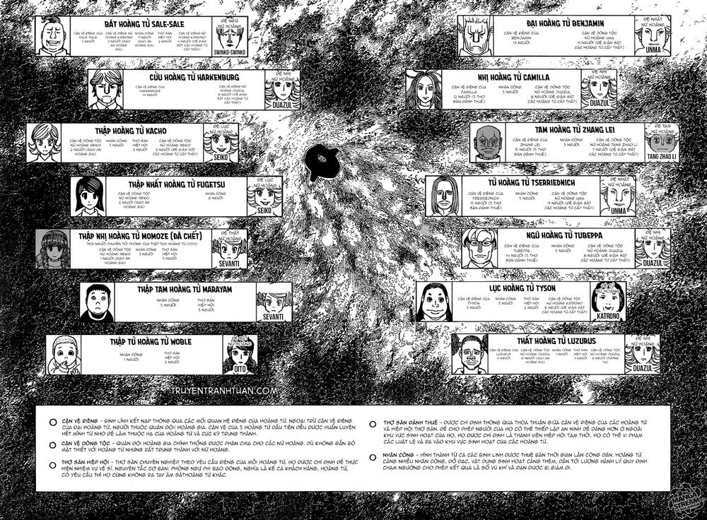

# HỆ THỐNG NHÂN VẬT CUỘC CHIẾN VƯƠNG QUYỀN

---

Arc này có rất nhiều thế lực cũng như hệ thống nhân vật cả phụ và chính nên mình viết hơi dài, các bạn thông cảm. Mình xin tóm tắt một số nhóm nhân vật và ảnh hưởng của họ đến cuộc chiến cũng như cả arc lục địa tối như sau:

### ➊. NHÓM HOÀNG TỘC KAKIN & THUỘC HẠ

(Sơ bộ lực lượng tính đến chap 374 )

Trong nhóm này lại phân ra các nhóm nhỏ:

- Nhóm các hoàng tử và vệ sĩ: nhân vật chính trong cuộc chiến vương vị diễn ra trong khoảng 2 tháng cho tới khi đến được tân lục địa. Hiện tại cuộc chiến chỉ còn 11 hoàng tử còn sống.

#### Đại hoàng tử Benjamin:

- Vị hoàng tử có thể nói là tích cực nhất và có kế hoạch rõ ràng nhất cho cuộc chiến này (thuộc loại giành chiến thắng bằng mọi giá, kể cả giết hoàng thân). Là hoàng tử đã sở hữu niệm và đang chiếm ưu thế nhất với vị thế là đại hoàng tử và là phó tổng tư lệnh tối cao của quân đội, Benjamin có vệ sĩ ở tất cả những hoàng tử còn lại (tất cả vệ sĩ của Benjamin đều là niệm nhân và tuyệt đối trung thành, đặc biệt tên đội trưởng Balsamico rất cáo già).
- Chiến thuật hiện tại: phân tích năng lực các thú niệm cũng như năng lực các hunter khác từ các vệ sĩ đang ở chỗ các hoàng tử khác báo về và các vệ sĩ sẽ ám sát các hoàng tử khi có thể (đã giết được bát hoàng tử Sale-Sale). Đồng thời, dùng năng lực Secret window "cú nghe lén" để theo dõi Camilla vì ưu tiên đánh giá năng lực của Camilla nguy hiểm hơn Halkenburg. Hiện sau phiên toàn với Camilla, Benjamin đang bị giam lỏng trong khu vvip.

#### Nhị hoàng tử Camila:

- Vị hoàng tử kiêu căng, ngạo mạn. Cũng giống Benjamin, Camilla cũng sẵn sàng giết hoàng thân của mình. Cô không có chiến thuật rõ ràng cho cuộc chiến và hành sự khá nóng vội và lỗ mãng. Là một trong những hoàng tử đã sở hữu niệm nhưng năng lực thuộc dạng phản phệ khá bị động. Tuy nhiên, Camilla có 1 nhóm cận vệ trung thành tuyệt đối và sẵn sàng chết đi để ám niệm các hoàng tử khác (1 dạng niệm hậu tử, có thể ám người khác, chi tiết các bạn có thể xem lại chap 389).
- Chiến thuật hiện tại: Camilla và Tyson (6th) là hoàng tử duy nhất không đưa vệ sĩ đến Kurapika tìm hiểu về niệm. Mục tiêu đối đầu ưu tiên là giết Benjamin trước sẽ đến Halkenburg. Nhưng việc ám sát Benjamin đã thất bại, sau phiên tòa cô và Benjamin bị giam lỏng trong khu vvip.

#### Tam hoàng tử Zhang-lei:

- Cũng là 1 trong những hoàng tử quan tâm đến ngai vàng nhưng cách tiếp cận có phần ôn hòa nên hiện tại anh chưa là mục tiêu ưu tiên tấn công của bất cứ hoàng tử nào khác. Thú niệm của anh có vẻ hoàn toàn vô dụng trong cuộc chiến này, nó chỉ tác dụng chỉ khi anh chiến thắng và trở thành vua. Nhận thấy tầm quan trọng của niệm, Zhang-Lei đã liên minh với Kurapika (đại diện cho thập tứ Woble) đổi lại những thông tin về niệm. Đồng thời, liên minh này còn bao gồm Ngũ hoàng tử Tuppeba và Cửu hoàng tử Halkenburg. Ngoài ra, Zhang Lei cũng có quan hệ mật thiết và nhà mafia Xi-yu (quản lý tầng 4 và là 1 trong 3 tập đoàn mafia trên tàu).

- Chiến thuật hiện tại: tiếp tục chờ đợi thêm thông tin về niệm trước khi hành động (từ lời khuyên của bố già Longbao nhà Xi-yu). Theo lời Longbao thì hoàng huynh Nasubi của mình cũng chiến thắng bằng cách đó, chiến lược ăn no ngủ kĩ, kiên nhẫn chờ thời =))

#### Tứ hoàng tử Tserriednich:

- Một hoàng tử có trí tuệ, nhạy bén, một tài năng thiên phú để học niệm nhưng bản chất có phần tà ác, cũng là hoàng tử sẵn sàng giết hoàng thân của mình trong cuộc chiến ngai vàng. Tserriednich có quan hệ mật thiết với Mafia nhà Heil-ly (quản lý tầng 3). Tứ hoàng tử đã phát triển được năng lực niệm và đang tiến bộ không ngừng.
- Chiến thuật hiện tại: Vẫn tiếp tục luyện tập niệm, đồng thời gửi vệ sĩ đến phòng Kurapika học niệm cũng như liên minh với Tubeppa nhầm ưu tiên chống lại những hoàng tử top đầu.

#### Ngũ hoàng tử Tubeppa:

- là 1 nhà khoa học, cô có vẻ là 1 người thông minh, quyết đoán, có tầm nhìn và thận trọng, có khao khát ngai vàng. Theo lời Shimano (người hầu của nữ hoàng Oito), mục địch của Tubeppa trong cuộc chiến là ngăn chặn các hoàng tử lớn hơn nắm ngai vàng. Do đó, Tubeppa ngõ ý muốn liên kết với tứ hoàng tử với mục tiêu chính là hạ bệ 3 hoàng tử đứng đầu Benjamin, Camilla và Zhang-lei.
- Chiến thuật hiện tại: lập hòa ước liên minh với Tứ hoàng tử. Lập hòa ước liên minh với Kurapika (đại diện cho thập tứ Woble) trong vòng 2 tuần để đổi lại thông tin về niệm và cử vệ sĩ học niệm. Hiện đang điều tra cái chết của bát hoàng tử Sale -Sale cũng như năng lực niệm các vệ sĩ của Benjamin để có cách ứng phó.

#### Cửu hoàng tử Halkenburg:

- Đây là hoàng tử mình đoán sẽ chiến thắng cuộc chiến (vì sao thì mình đã có 1 bài viết về dự đoán này.

[Dự đoán Vua kế tiếp của Kakin](./vuakakin.md)

- Halkenburg là người theo chủ nghĩa hòa bình, ban đầu không hề muốn tham gia cuộc chiến, anh muốn thay đổi nền chính trị của Kakin. Sau lần gặp vua cha để muốn kết thúc cuộc này nhưng bất thành, Halkenburg đã chịu ảnh hưởng từ lời nói của vua rằng bất cứ thay đổi nào mà Halkenburg muốn thực hiện ở Kakin, anh ta phải tự mình thực hiện sau khi nắm quyền làm vua.

- Điều này khiến anh chính thức tham gia cuộc chính với quyết tâm chiến thắng.

- Chiến thuật hiện tại: tiếp tục cho vệ sĩ đến học niệm ở Kurapika. Tìm hiểu về năng lực niệm của bản thân. Sau khi có năng lực niệm Halkenburg đã tấn công và giết Shikaku (vệ sĩ của Benjamin) và ở chap gần nhất Halkenburg tấn công Vikto (vệ sĩ của Benjamin) có thể là để test thêm năng lực của mình. Hiện tại đang bị bắt tạm giam để điều tra do nghi ngờ có liên quan đến vụ giết người hàng loạt ở tầng dưới. (thực chất là do Balsaminco và Benjamin cố tình vu vạ để bắt và cách ly Halkenburg với thuộc hạ).

#### Các hoàng tử còn lại

- bao gồm: lục hoàng tử Tyson, Thất hoàng Luzurus, Thập nhất hoàng tử Fugetsu, Thập tam hoàng tử Marayam và thập tứ Woble, nhóm này mình không đánh giá cao về vai trò trong cuộc chiến. Theo lời của Ngũ hoàng tử Tubeppa thì Tyson, Luzurus không có tham vọng gây chiến (mặc dù Luzurus muốn nhắm đến Tubeppa đầu tiên), Fugetsu, Marayam, Woble thì còn quá nhỏ, không có tham vọng hay quyền lực cũng như mối quan hệ. Trong nhóm này chỉ có Luzurus là có mối quan hệ với mafia, đó là nhà mafia Char-r (quản lý tầng 5)
- Chiến thuật hiện tại: Tyson không gửi vệ sĩ đến Kurapika học niệm, hiện đang vô tư vui vẻ yêu đời với các vệ sĩ, không có động thái gì đến cuộc chiến. Luzurus cũng chưa có hành động gì ngoài việc cử vệ sĩ đến Kura học niệm và "smoke weed everyday" 😆 . Fugetsu thì không có tham vọng ngai vàng, hiện đang cùng bản sao của Kacho bị bộ tư pháp thẩm vấn vì quyết định bỏ trốn. Marayam thì quá nhỏ để nhận biết cuộc chiến này, hiện đang khá an toàn trong căn phòng bí mật do thú niệm tạo ra. Woble thì đang được main Kura bảo kê tận răng =))

#### Link năng lực các hoàng tử: [Chi tiết năng lực](./nangluc01.md)

#### Nhóm các hoàng hậu:

Nhóm này khá tích cực hỗ trợ các con ruột của mình trong cuộc chiến bằng vệ sĩ riêng thậm chí là giết các hoàng tử khác (vệ sĩ của ngũ hoàng hậu Swinko đã giết thập nhị hoàng tử Momoze) . Ngoại trừ đệ nhị nữ hoàng Duazul có vẻ tốt, chủ trương trung lập (nhưng cũng không loại trừ khả năng sẽ bị thao túng do năng lực thú niệm của Camilla). Còn nữ hoàng Oito (mẹ Woble) cũng tốt bụng, yếu thế lực và chỉ muốn cùng Woble an toàn rời cuộc chiến.

### ➋. NHÓM BĂNG ĐẢNG MAFIA

Mỗi băng đều có quan hệ mật thiết với 1 hoàng tử cụ thể: Nhà Xi-yu liên kết với tam hoàng tử Zhang-lie, nhà Cha-R liên kết với thất hoàng tử Luzurus, nhà Heil-ly liên kết với tứ hoàng tử Tserriednich. Cả ba nhà đều không ưa nhau và luôn chủ trương thanh trừng nhau, làm giảm số lượng của nhau cho đến khi đến tân lục địa.

#### Nhà Xi-yu:

- Là nhóm mafia mạnh nhất về tài chính cũng như về số lượng, đang cai quản tầng 4 và kiếm tiền bằng việc buôn bán người và hàng hóa cũng như kiểm soát giao thương giữa các tầng thông qua tầng 4. Đứng đầu là ông trùm Longbao đang là vip ở tầng 1 điều hành băng thông qua các bố trẻ bên dưới. Hiện băng đã mất 300 nhân lực có thể băng Heil-ly giết để tăng cấp năng lực, do đó chủ trương là nghiền nát băng Heil-ly, tìm kiếm Hisoka ở tầng 3 trước khi cho băng nhện lên tầng 4 (có thể là để làm con tin trao đổi gì đó với nhện).

#### Nhà Cha-R:

- Khoảng 250 thành viên, hoạt động ở tầng 5. Bố già là Brocco-li đang là vip ở tầng 1. Chủ trương vẫn là tìm Hisoka trước băng nhện. Đồng thời cũng thanh trừng lẫn nhau giữa các băng đảng. Hiện Phinks, Feitan và Nobunaga đang ở xào huyệt băng này, họ định sẽ giúp truy sát tên sát thủ băng Heil-ly cũng như cả bố già Morena đổi lại là băng nhện được lên tầng trên.

#### Nhà Heil-ly:

- Mới có cuộc đảo chính và bố già mới là Morena, có vẻ đã có 1 cuộc tàn sát thành viên cũ từ Morena và hiện tại chỉ còn 23 thành viên tính cả cô. Băng này cai quản tầng 3, chủ yếu thu nhập từ việc giao thương, trao đổi bí mật giữa các tầng bên dưới lên tầng trên thông qua tầng 3. Chủ trương là giết càng nhiều người càng tốt, giết bất cứ ai để tăng cấp năng lực. Về năng lực của Morena chi tiết các bạn xem lại chap 378.

### ➌. THẬP NHỊ CHI VÀ CÁC HUNTER

Các thập nhị chi trước mắt không có vai trò nhiều trong cuộc chiến vương quyền mà chỉ có vai trò đảm bảo an ninh cùng với quân đội hoàng gia Kakin trong cuộc hành trình 2 tháng hoặc khi có bạo loạn xảy ra (theo mình khả năng cao là có) và ngoại trừ Kurapika đang trực tiếp có vai trò quan trọng trong cuộc chiến vương quyền đẫm máu này.

#### Kurapika:

- Mục đích ban đầu là để làm vệ sĩ cho hoàng tử Tserriednich (mục đích là lấy lại số mắt đỏ) hoặc Halkenburg (người có quan hệ thân với Tserriednich). Nhưng 6 hoàng tử thuê hunter chuyên nghiệp đều ẩn danh nên để chắc chắn Kura đã thuê Izunavi, Bisky, Hanzo, Basho, Melody mỗi người vào ứng tuyển 1 hoàng tử. Dòng đời xô đẩy Kura vào làm vệ sĩ cho thập tứ Woble và bắt đầu bị xoáy vào cuộc chiến tranh ngai vàng. Để tạo thế cân bằng hơn và giảm bớt áp lực lên những hoàng tử yếu thế, Kura đã dạy niệm cho tất cả các vệ sĩ của tất cả hoàng tử muốn tìm hiểu về niệm.

* Tình hình hiện tại: vô cùng nguy hiểm, tiếp tục dạy niệm cho các vệ sĩ, vừa phải đối phó với sát thủ sử dụng Silent Majority, vừa phải đảm bảo an toàn cho nữ hoàng Oito cũng như hoàng tử Woble. Kế hoạch tiếp cận tứ hoàng tử và số mắt đỏ vẫn chưa thực hiện được.

#### Các thập nhị chi khác:

- mỗi người có nhiệm vụ riêng, Mizaistom thì thuộc đội tình báo và đang điều tra vụ giết người hàng loạt của sát thủ nhà Heil-ly ở tầng 3. Botobai thì thuộc đội phòng vệ, hoạt động an ninh và tòa án chủ yếu ở tầng 3 và 4. Saiyu, Saccho, Kanzai thì canh giữ Beyond ở tầng 1. Cheadle và Leorio thì hỗ trợ y tế ở tầng 3. Gel, Pyon, Ginta và Cluck tổ chức một cuộc họp ở tầng 3 để thảo luận về kế hoạch ở tân lục địa và hành trình tiếp theo đến Lục địa đen với các thợ săn khác.

### ➍. BĂNG RYODAN

Mục đích tiên quyết khi lên tàu chính là truy sát Hisoka sau đó mới đến kho báu. Hiện tại đã chia nhau ra truy tìm và sẽ gặp lại nhau ở tầng 5 khi đã có cái đầu của Hisoka:

- Feitan, Phinks và Nobunaga đang ở sào huyệt nhà Cha-R để tìm cách lên các tầng trên truy tìm Hisoka.
- Chrollo, Shizuku, Bonolenov thì đang lập team đi chung ở tầng 4.
- Machi thì đi 1 mình ở tầng 5.
- Franklin thì 1 mình ở tầng 5 với chiến thuật ăn no ngủ kĩ, đợi Hisoka tự tìm đến mình.
- Illumi và Kalluto thì với vé Vip đang ở tầng 3. Nhưng giờ đang giới nghiêm nên đang ở chổ Botobai và Ginta.

* Về số phận của băng Ryodan mình sẽ có 1 bài viết giả thuyết dự đoán riêng =))
* Còn về nhóm Pariston và Ging vẫn chưa xuất hiện cũng như có động tĩnh gì.
* Bài viết sẽ cập nhật nếu truyện hết hiatus

**HẾT**

Xem các phần :

- [Phần 01 Lục địa tối](./phan01.md)
- [Phần 2 Sơ bộ về cuộc chiến vương quyền](./phan02.md)
