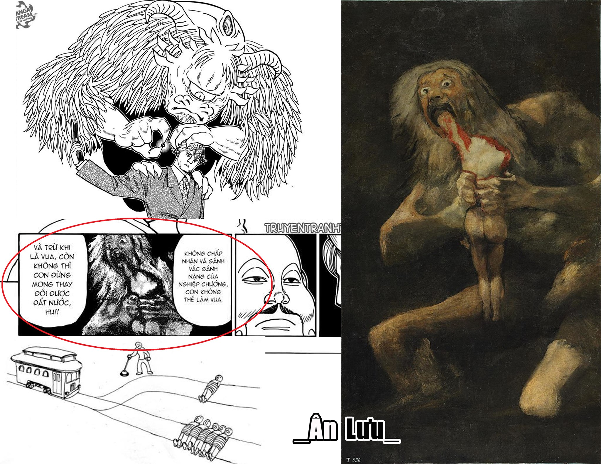

HALKENBURG - VỊ VUA TIẾP THEO CỦA VƯƠNG TRIỀU KAKIN ?

---

Ở chương 382, khi mà Halkenburg đến gặp vua cha Nasubi để muốn kết thúc cuộc chiến vương quyền có 2 chi tiết khá thú vị: Bức tranh "Saturn devouring his son" và khái niệm "Trolley problem". Mình xin phân tích 1 chút như sau:

➊. Bức tranh "Saturn devouring his son" (Saturn ăn thịt con trai)

Đây là 1 trong 14 bức tranh đen nổi tiếng của Francisco Goya (nghệ sĩ vẽ tranh người Tây Ban Nha), những bức tranh này được tạo ra sau khi Goya đã sống sót sau hai căn bệnh gần như gây tử vong, những bức tranh được gọi là tranh đen do việc sử dụng các sắc tố đen tối của các nghệ sĩ và chủ đề mơ hồ của họ. Chúng được Goya vẽ lên tường và sau này được chuyển lên vải trong năm 1873 trước khi được trao cho Museo del Prado của Madrid trong 1899. Bức tranh đen thứ 12 vẽ cảnh Saturn đang ăn thịt đứa con của mình.

Nói 1 chút về thần thoại trong bức tranh, Saturn là một vị thần trong thần thoại La Mã, tương tự với ông là vị thần Cronus trong thần thoại Hy Lạp.

Cronus là con út của thần Uranus và Gaia, là 1 trong 12 titan, để trả thù cho các anh em mình bị cha Uranus đày xuống địa ngục, Cronus đã đánh bại cha mình. Cũng chính vì thế mà ông lo ngại số mệnh của mình cũng sẽ bị chính những đứa con mình lật đổ như chính mình đã từng làm với cha, Cronus đã ăn thịt hết 5 đứa con mà Rhea - vợ của ông sinh ra. Đến đứa thứ 6, Rhea đau xót và giận dữ tìm đến lời khuyên của mẹ và đi đến hang đá trên ngọn núi Ida hùng vĩ. Ngày chuyển dạ, Rhea sinh được 1 nam thần, đặt tên là Zeus nhưng không đưa cho chồng mà thay vào đó nàng gói 1 hòn đá vào tã để Cronos nuốt. Thời gian trôi qua, Zeus đã trở thành 1 nam thần hùng mạnh, tài giỏi và sau này đã đánh bại Cronus và hồi sinh các anh em của mình. Zeus sẽ là chúa tể bầu trời, Poseidon cai quản biển cả còn Hades sẽ lo về địa ngục, Hera, Demeter, Hestia lần lượt phụ trách hôn nhân gia đình, mùa màng nông nghiệp và bếp lửa gia đình.

Chim đại bàng là chúa tể của bầu trời, biểu tượng cho sức mạnh, lòng can đảm, tầm nhìn xa và sự bất tử là 1 trong những biểu tượng của thần Zeus, bên cạnh đó thì hình tượng con bò cũng luôn gắn liền với Zeus với những câu chuyện thần thoại về mình. "Chim và bò", các bạn có thấy quen không? Có liên tưởng đến thú niệm của hoàng tử nào không? Đó là Halkenburg. Tại sao đa phần thú niệm các hoàng tử lại phần nào phản ánh bản chất, tính cách của hoàng tử, nhưng Halkenburg lại có thú niệm hình bò và chim? Có phải ngẫu nhiên không?

Ở đây Halkenburg và Zeus có chút tương đồng, cũng đứng trước bờ vực chết chóc, anh chị em đều sớm muộn cũng phải chết mà nguyên nhân cũng từ vua cha. Vua Nasubi cũng đã nói muốn thay đổi Kakin thì hãy lên làm vua và thay đổi nó, vậy sẽ như thế nào nếu Halkenburg không đi theo cách thức của cuộc chiến đẫm máu mà đi theo cách giết chết vua Nasubi và trở thành vua như cách Zeus đánh bại cha của mình. Halkenburg đã thử và thất bại, nhưng đó là do chưa phải lúc, mọi chuyện sẽ khác nếu như Halkenburg mạnh mẽ hơn với niệm lực và nếu có thể là có sự trợ giúp của Kurapika. Qua lời kể của Oito về Halkenburg ở chap 350, Kura ắt cũng ý thức được rằng để cứu được Oito và Woble bằng cách trốn khỏi cuộc chiến là điều không thể, mà phải trông cậy vào vị vua tiếp theo đủ tốt để thay đổi Kakin và dừng cuộc chiến, cứu những người anh em còn sống còn lại. Người được trông đợi đó thì còn ai phù hợp hơn Halkenburg! Các bạn cứ xem lại chap 350 sẽ thấy!

Nếu theo hướng suy nghĩ của mình thì Vua Nasubi cũng có gợi ý về khả năng này. Đó là khái niệm "Trolley problem"

➋. Khái niệm "Trolley problem"

The Trolley problem là một thí nghiệm về trết lý đạo đức rất nổi tiếng được dạy ở rất nhiều trường Luật tại Mỹ. Nội dung của thí nghiệm đó như sau:

Bạn nhìn thấy một đoàn tàu chạy trên đường ray, nhưng trên đó có 5 công nhân đang bị mắc kẹt. Bạn đứng kế một công tắc mà khi bấm thì đoàn tàu sẽ chuyển sang một đường ray khác bên đó chỉ có 1 công nhân bị mắc kẹt. Lúc này bạn có 2 lựa chọn:

1. Không làm gì cả và để đoàn tàu giết 5 người

2. Bấm công tắc để đoàn tàu chuyển hướng và hy sinh 1 người để cứu 5 người.

Vậy điều đúng đắn phải làm là gì?

Halkenburg phải đứng trước lựa chọn: 1 bên là vua cha, 1 bên là anh chị em và cả 200k thần dân trên tàu (số này vốn dĩ xem như vật hiến tế cho cuộc chiến, tàn sát thoải mái)

" Quốc gia là thứ nên được tồn tại, chính sinh mạng người dân là lựa chọn cần thiết" - Vua Nasubi

Mình dự đoán Halkenburg sau này sẽ vẫn quay lại chọn cách giết vua cha và kết thúc cuộc chiến.

Hy vọng nữa hết hiatus sẽ có lúc repost lại bài này để so sánh xem có chính xác không.

